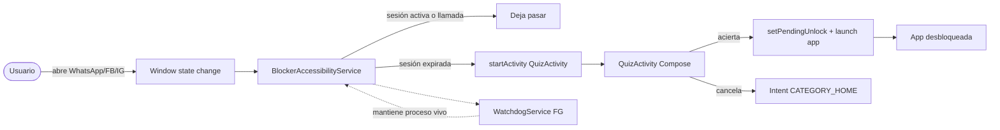
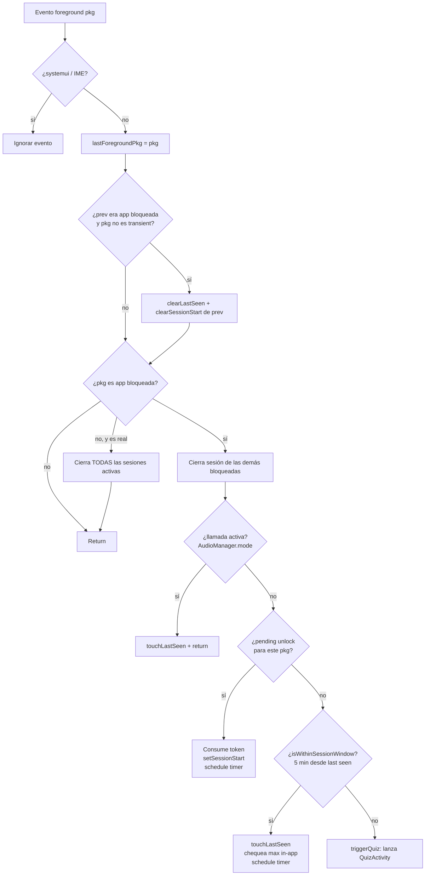
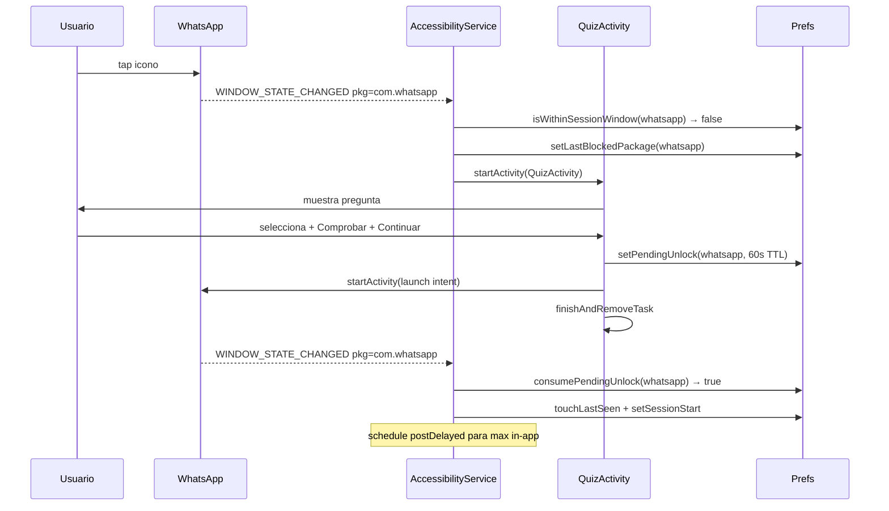

# Quiz Gate

Bloquea WhatsApp, Facebook e Instagram detrás de preguntas del banco de **AWS Cloud Practitioner**. Cada vez que abres una app bloqueada (entrada fresca o expirada la sesión) tienes que acertar una pregunta antes de poder usarla. Pensado para HyperOS / MIUI / Android stock (API 24+).

- **Origen del banco**: API HTTP (default `https://codecsrayo.com/api/quiz/practitioner`)
- **UI nativa**: Jetpack Compose + Material 3
- **Bilingüe**: ES / EN
- **Sin dependencias pesadas**: `org.json` + `HttpURLConnection`

---

## Cómo funciona (alto nivel)



`BlockerAccessibilityService` observa transiciones de foreground. `WatchdogService` es un foreground service con notificación silenciosa que mantiene el proceso vivo — sin él HyperOS mata el AccessibilityService o bloquea `startActivity` por **Background Activity Launch**.

---

## Reglas de sesión y desbloqueo

El service decide para cada `TYPE_WINDOW_STATE_CHANGED` qué hacer:



### Conceptos

| Concepto | TTL | Significado |
|---|---|---|
| `pendingUnlock[pkg]` | 60 s | Token de un solo uso emitido por QuizActivity al acertar. Consumido por el service en el próximo foreground del pkg. |
| `lastSeen[pkg]` | 5 min (SESSION_WINDOW) | Última vez que pkg estuvo en foreground. Si vuelves dentro de la ventana, sin quiz. |
| `sessionStart[pkg]` | hasta reset | Cuándo empezó la sesión actual. Se compara contra `maxInAppMs` para el cuestionario por tiempo. |

### Apps "transient" (no rompen sesión)
`systemui`, `miui.systemui.plugin`, `com.miui.home` y otros launchers conocidos. Cuando deslizas notificaciones o pasas brevemente por el launcher, la sesión sigue activa.

### Llamadas
Si `AudioManager.mode` es `MODE_RINGTONE`, `MODE_IN_COMMUNICATION` o `MODE_IN_CALL`, el quiz se omite — puedes contestar la llamada sin acertar primero.

### WhatsApp y el timer in-app
WhatsApp está en `IN_APP_TIMER_EXEMPT` — el cuestionario por tiempo prolongado no se aplica (sólo al entrar). Conversaciones largas no se interrumpen.

---

## Anatomía de un desbloqueo



---

## Permisos requeridos

| Permiso | Por qué | Cómo se concede |
|---|---|---|
| `BIND_ACCESSIBILITY_SERVICE` | Detectar app en foreground | Ajustes → Accesibilidad → Quiz Gate |
| `SYSTEM_ALERT_WINDOW` | Reforzar la activity del quiz | Diálogo Android estándar (botón en MainActivity) |
| `REQUEST_IGNORE_BATTERY_OPTIMIZATIONS` | Que HyperOS no mate el service | Diálogo Android estándar |
| `FOREGROUND_SERVICE_SPECIAL_USE` | Para el WatchdogService | Manifest, no requiere acción del usuario |
| `POST_NOTIFICATIONS` | Notificación del Watchdog | Diálogo en primera apertura (Android 13+) |
| **MIUI "Otros permisos"** | **Crítico**: "Mostrar ventanas emergentes en segundo plano" + "Mostrar en pantalla de bloqueo" | Botón en MainActivity → editor de permisos MIUI |

> ⚠️ Sin el último (MIUI), `startActivity` desde el AccessibilityService es **denegado silenciosamente** por HyperOS, la activity nunca llega a `onCreate`. Síntoma: ves un parpadeo y nada más.

---

## Configuración (Settings card)

| Setting | Default | Notas |
|---|---|---|
| Apps bloqueadas | FB, FB Lite, WhatsApp, Instagram | Checkboxes |
| Tiempo máximo en la app | 10 min | Segmented `0 · 5 · 10 · 20 · 30 · 60`. `0` = ∞ |
| Idioma | ES | ES / EN, aplica a las preguntas |
| URL de la API | `https://codecsrayo.com/api/quiz/practitioner` | Editable |
| Sincronizar ahora | — | Descarga y cachea el JSON |

---

## Contrato del JSON

```json
[
  {
    "id": "AWS-CHAT-001",
    "domain": "technology",
    "domainLabel": { "es": "Tecnología", "en": "Technology" },
    "questionType": "multiple-choice",
    "scenarioBased": true,
    "q": { "es": "¿…?", "en": "…?" },
    "options": {
      "es": ["CloudFront", "Route53", "ELB", "NAT Gateway"],
      "en": ["CloudFront", "Route53", "ELB", "NAT Gateway"]
    },
    "answer": 1,
    "answers": [0, 1],
    "explanation": { "es": "…", "en": "…" },
    "tip": { "es": "…", "en": "…" }
  }
]
```

- `questionType` = `"multiple-choice"` (radio, una respuesta) o `"multiple-response"` (checkbox, varias).
- `answer` (int) = índice correcto para multiple-choice.
- `answers` (array de int) = índices correctos para multiple-response. Si está presente, prevalece sobre `answer`.
- Las preguntas en caché viven en `filesDir/quiz_practitioner.json`.

---

## Estructura del proyecto

```
app/src/main/
├── AndroidManifest.xml
├── java/com/example/ask/
│   ├── MainActivity.kt              # UI de configuración (Compose)
│   ├── QuizActivity.kt              # UI del cuestionario (Compose, fullscreen)
│   ├── BlockerAccessibilityService.kt  # detecta foreground + dispara quiz
│   ├── WatchdogService.kt           # foreground service para mantener proceso vivo
│   ├── Permissions.kt               # helpers para abrir Settings de cada permiso
│   ├── Prefs.kt                     # SharedPreferences wrapper
│   ├── Question.kt                  # modelo + parser JSON
│   ├── QuizRepository.kt            # descarga y cachea preguntas
│   └── ui/theme/                    # tema Compose (DayNight)
└── res/
    ├── values/themes.xml            # Material Light
    ├── values-night/themes.xml      # Material Dark
    ├── values/strings.xml           # textos ES
    └── xml/accessibility_service_config.xml
```

---

## Build & install

```powershell
$env:JAVA_HOME = "C:\Program Files\Android\Android Studio\jbr"
.\gradlew :app:assembleDebug

$adb = "$env:LOCALAPPDATA\Android\Sdk\platform-tools\adb.exe"
& $adb install -r app\build\outputs\apk\debug\app-debug.apk
```

Requisitos:
- Android Studio Ladybug+ (compileSdk 36)
- min SDK 24, target 36
- JDK 11+

---

## Debugging

Los logs relevantes se emiten con tag `QuizGate`:

```powershell
& "$env:LOCALAPPDATA\Android\Sdk\platform-tools\adb.exe" logcat -s QuizGate
```

Eventos clave:
- `AccessibilityService connected` — accesibilidad activa
- `blocking <pkg> → launching QuizActivity` — disparo del quiz
- `consumed pending unlock for <pkg>` — desbloqueo exitoso
- `in active session for <pkg>, skipping quiz` — sesión vigente, sin quiz
- `leaving <pkg> → real app <other>, ending session` — sesión cerrada por cambio de app
- `active call detected, bypassing quiz for <pkg>` — llamada en curso
- `QuizActivity onCreate/onResume/onPause/onDestroy isFinishing=...` — ciclo de vida (útil si HyperOS está matando la activity: `isFinishing=false` = el sistema la mató)

---

## Notas sobre HyperOS / MIUI

1. **Background Activity Launch**: WatchdogService + permiso "popup en segundo plano" son ambos necesarios. Faltar cualquiera de los dos hace que el quiz nunca aparezca o se cierre solo.
2. **Auto-start**: si el service muere tras reiniciar el teléfono o tras unos minutos en idle, activa el auto-inicio en *Seguridad → Permisos → Autostart*.
3. **Optimización de batería**: HyperOS reaplica restricciones agresivas. Si el comportamiento se degrada con el tiempo, revisa *Ajustes → Batería → Quiz Gate → Sin restricciones*.
4. **WRITE_SECURE_SETTINGS** (para activar accesibilidad por adb) está bloqueado en HyperOS salvo que tengas la cuenta Mi vinculada y "Security Settings" en debugging habilitado.

---

## Limitaciones conocidas

- Selección de preguntas es **random uniforme** del pool — no hay anti-repetición ni ponderación por fallos.
- No hay persistencia de estadísticas de aciertos / fallos.
- El listado de "apps bloqueables" es fijo (`KNOWN_APPS` en MainActivity); para añadir otra hay que tocar código.
- Sin pruebas automatizadas.
